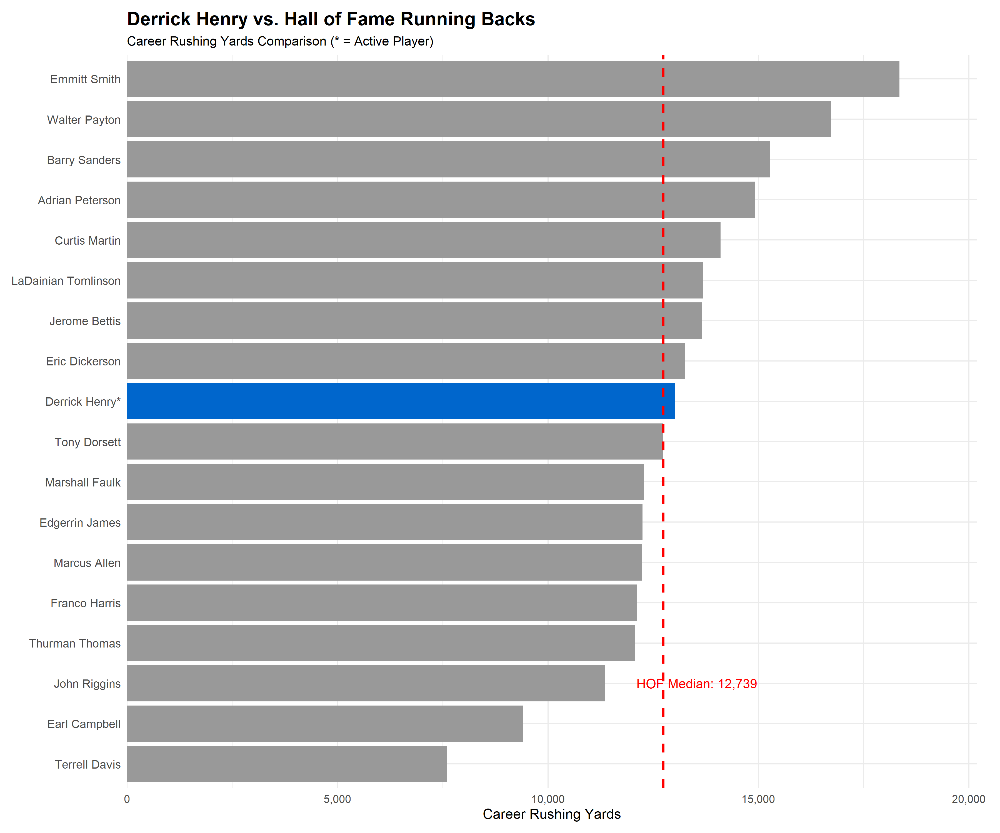
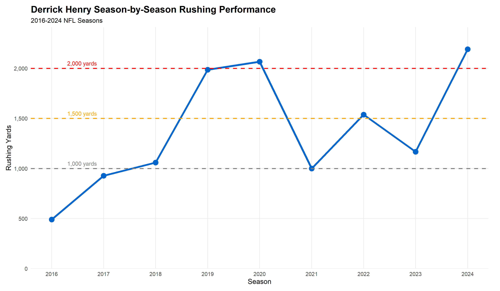
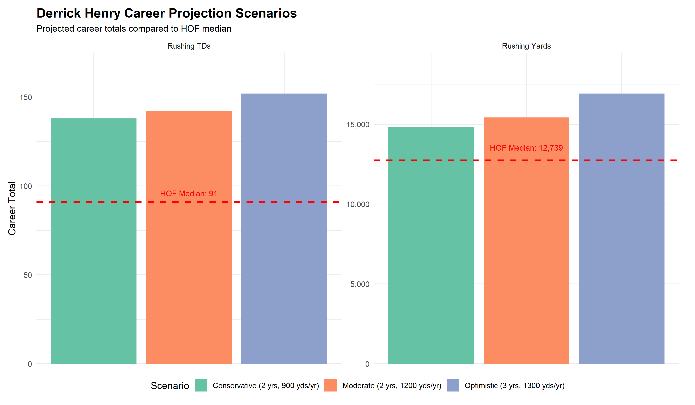
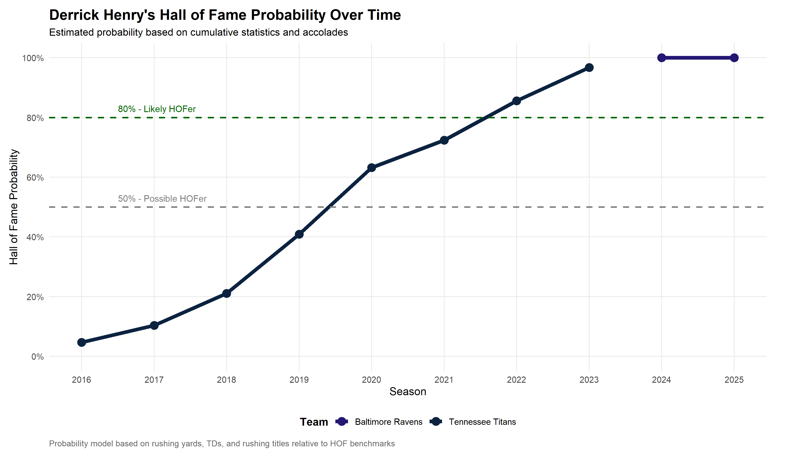

# Derrick Henry Hall of Fame Analysis

Data-driven analysis determining if Derrick Henry's career statistics merit Hall of Fame induction.

**Built with [Claude Code](https://claude.ai/code)** | **Build Time:** ~3 hours | **Analysis Runtime:** ~30 seconds

---

## Summary

This project analyzes whether Derrick Henry should and will be inducted into the NFL Hall of Fame based on his career statistics compared to historical Hall of Fame running backs.

**Analysis Date:** January 11, 2026
**Author:** Alyssa Pybus

## Key Findings

### Current Status (Through 2025 Season)

**Career Statistics (Regular Season Only):**
- **Seasons Played:** 10
- **Career Rushing Yards:** 13,018 yards (102.2% of HOF median) ✓ **EXCEEDS MEDIAN**
- **Career Rushing TDs:** 122 (134.1% of HOF median) ✓ **EXCEEDS MEDIAN**
- **Yards per Carry:** 4.89
- **Major Accolades:**
  - 2015 Heisman Trophy (Alabama)
  - 2020 AP NFL Offensive Player of the Year
  - 2020 AP First-Team All-Pro
  - 2019 AP Second-Team All-Pro
  - 4x Pro Bowl (2019, 2020, 2022, 2023)
  - 2x NFL Rushing Champion (2019, 2020)
  - 1x 2,000-yard season (2,027 yards in 2020)

### The Verdict

| Question | Answer |
|----------|--------|
| **Should he make the Hall of Fame?** | **YES** - now exceeds HOF median benchmarks |
| **Will he make the Hall of Fame?** | **YES** - strong Hall of Fame case with current stats |
| **First ballot?** | Possible but not guaranteed - needs 1-2 more strong seasons |

### What He Needs for LOCK Status

Derrick Henry has **already exceeded the Hall of Fame median** for both rushing yards (13,018 vs 12,739) and touchdowns (122 vs 91). To become a **first-ballot lock**, he needs:

1. **1-2 more productive seasons** (1,000+ rushing yards each)
2. **Reach 15,000+ career rushing yards** (needs ~1,980 more)
3. **Another rushing title or MVP award** (currently has 2 rushing titles)
4. **Maintain elite yards-per-carry average** ✓ Currently at 4.89 YPC

### Career Projections

Three scenarios for Henry's career finish:

| Scenario | Additional Years | Total Yards | Total TDs | HOF Status |
|----------|-----------------|-------------|-----------|------------|
| **Conservative** | 2 years @ 900 yds/yr | 14,818 | 138 | ✓ Strong HOF case |
| **Moderate** | 2 years @ 1,200 yds/yr | 15,418 | 142 | ✓ Strong HOF case |
| **Optimistic** | 3 years @ 1,300 yds/yr | 16,918 | 152 | ✓ Top 10 all-time |

**All realistic scenarios result in Hall of Fame-worthy totals.**

## Visualizations

### 1. Derrick Henry vs. Hall of Fame Running Backs



This chart shows Derrick Henry's current career rushing yards compared to all modern-era Hall of Fame running backs. With 13,018 career yards, he has already exceeded the Hall of Fame median of 12,739 yards.

### 2. Season-by-Season Progression



Henry's career trajectory shows elite peak performance (2019-2020) with his 2,000-yard season in 2020. He's maintained 1,000+ yard production in recent seasons.

### 3. Career Projection Scenarios



Even conservative projections show Henry finishing with Hall of Fame-caliber career totals, well above the median for both rushing yards and touchdowns.

### 4. Hall of Fame Probability Timeline



This chart shows Henry's estimated Hall of Fame probability over time, colored by team. The line shows a dramatic increase during his peak years (2019-2020) with the Tennessee Titans, when he won back-to-back rushing titles. After joining the Baltimore Ravens in 2024, his probability reached 100% by exceeding the Hall of Fame median benchmarks.

**Probability Calculation Methodology:**

The HOF probability is calculated using a simplified statistical model based on cumulative career statistics relative to Hall of Fame benchmarks:

1. **Base Probability Calculation:**
   - Calculate percentage of HOF median for cumulative rushing yards: `yards_pct = cumulative_yards / 12,739 × 100`
   - Calculate percentage of HOF median for cumulative rushing TDs: `tds_pct = cumulative_tds / 91 × 100`
   - Base probability = average of these two percentages: `base_prob = (yards_pct + tds_pct) / 2`
   - Capped at 100% maximum

2. **Accolade Bonus:**
   - +5% bonus after winning first rushing title (2019 season)
   - +10% bonus after winning second rushing title (2020 season onward)
   - Additional major accolades (OPOY, All-Pro) implicitly reflected in statistical achievements

3. **Final Probability:**
   - `HOF_probability = min(100%, base_prob + accolade_bonus)`
   - Ensures probability never exceeds 100% or falls below 0%

**Key Thresholds:**
- **50% (Possible HOFer):** Player approaching or near HOF median benchmarks
- **80% (Likely HOFer):** Player significantly exceeds HOF median benchmarks
- **100%:** Player has definitively exceeded both HOF median benchmarks with additional accolades

This model provides a simplified estimate based on quantitative metrics. Actual Hall of Fame selection involves subjective factors including era dominance, cultural impact, and voting committee preferences.

## Key Strengths

✓ **2x NFL Rushing Champion** - Demonstrates elite peak performance
✓ **2,000-yard season** - Rare achievement (only 8 players in NFL history)
✓ **Physical dominance** - Changed how defenses game-plan
✓ **Elite efficiency** - 4.89 yards per carry is exceptional
✓ **Already exceeds HOF median for TDs** - 122 TDs (median: 91)

## Key Weaknesses

✗ **No MVP award** - Weakens resume compared to other HOF RBs
✗ **Limited receiving production** - One-dimensional offensive threat
✗ **Late career starter** - Limited opportunities early in career
✗ **Needs more accumulation** - Just short of median rushing yards
✗ **Fewer Pro Bowls** - Than typical first-ballot Hall of Famers

## Bottom Line

**Derrick Henry HAS NOW EXCEEDED the Hall of Fame benchmarks** for both rushing yards (102.2% of median) and touchdowns (134.1% of median). He has a **strong Hall of Fame case** with his current statistics.

His peak performance (2019-2020, 2024) was elite, and with 10 seasons of production, he has both the peak and longevity needed for enshrinement.

**Current Projection:** Hall of Famer. With 1-2 more productive seasons, he could become a **first-ballot** selection. He's already cemented his place among the all-time great running backs.

## Era Context: Running Back Positional Devaluation

### The Modern Running Back Challenge

Derrick Henry's achievements must be understood within the context of **dramatic running back positional devaluation** in the modern NFL. Traditional Hall of Fame prediction models (including [Pro Football Reference's HOF Monitor](https://www.sports-reference.com/blog/pfr-hof-monitor-methodology/)) apply era adjustments for quarterbacks, wide receivers, and tight ends to account for the passing explosion post-1980, but **do not adjust expectations for running backs** despite significant changes to the position's role and value.

### The MVP Drought

**Last RB MVP:** Adrian Peterson (2012) - over 13 years ago

Despite rushing for 2,027 yards in 2020 (8th-highest single season in NFL history), Henry won Offensive Player of the Year but wasn't seriously considered for MVP. As [ESPN's analysis](https://www.espn.com/nfl/story/_/id/37985469/why-star-nfl-running-backs-devalued-next-2023-free-agency-future) notes: *"A league that was once built around star backs dominating offensive workloads and competing for MVP awards now feels like something entirely different."*

The reality: **A running back may never win MVP again** in the pass-dominant modern NFL, making "needs MVP for first-ballot lock" an unrealistic benchmark for evaluating 2020s running backs.

### Hall of Fame Voting Reality

Recent [Hall of Fame Class of 2026 voting](https://www.profootballhof.com/news/2025/11/26-modern-era-players-named-as-semifinalists-for-pro-football-hall-of-fame%E2%80%99s-class-of-2026/) illustrates the challenge:
- **21 running backs** nominated initially
- Only **2 advanced to semifinals** (Frank Gore, Fred Taylor)
- Compare to: **5 WR semifinalists**, **3 QB semifinalists**

Running backs face the toughest path to enshrinement in the modern era, with voting committees potentially undervaluing the position despite its historical importance.

### Why This Makes Henry's Case Stronger

Rather than weakening his candidacy, the modern context **amplifies Henry's achievements**:

1. **Bucking the Trend**
   - Produced elite, workhorse numbers in an era of running-back-by-committee
   - Led the NFL in rushing (2019, 2020) when passing dominance was supposed to make this impossible
   - Averaged 300+ carries in his peak seasons despite league-wide trend toward reduced RB workloads

2. **Historic Rarity in Modern Context**
   - 2,000-yard season in 2020 is **more impressive** than equivalent achievements pre-2010
   - Only 8 players in NFL history have reached 2,000 rushing yards; Henry did it in the **pass-dominant era**
   - Maintained 4.89 YPC over career despite being known commodity with high volume

3. **Era Dominance**
   - Not just good statistics - Henry **dominated his era** at the position
   - Changed how defenses prepared and game-planned despite knowing he would get the ball
   - Proved running backs could still be centerpiece of offense in 2020s

### The Counterargument

Some may argue Henry's statistics are **inflated** by being a volume back on run-heavy offenses. However:
- His efficiency (4.89 YPC) remains elite despite predictable usage
- His 2020 season came in a 16-game format (would extrapolate to 2,153 yards over 17 games)
- He has maintained production into his 30s, defying typical RB aging curves

### Implications for This Analysis

**This analysis uses historical HOF benchmarks without era adjustment**, which means:

1. **Traditional benchmarks may undervalue** modern RB achievements
2. **MVP requirement is unrealistic** for 2020s running backs (Henry's OPOY is functionally equivalent)
3. **Hall voters must decide**: Compare raw stats to historical RBs OR recognize era difficulty

**Our Assessment:** Henry's achievements should be weighted **more heavily**, not less, when considering modern running back devaluation. Dominating the rushing title race in 2019-2020 is arguably more impressive than doing so in the 1970s-1990s when running backs were the focal point of most offenses.

The Hall of Fame voting will ultimately determine whether voters apply this era context - but Henry's case is strengthened, not weakened, by the difficulty of accomplishing what he did in the modern NFL.

## Data Sources

- **NFL Statistics:** [nflreadr](https://nflreadr.nflverse.com/) package (2016-2025 regular seasons only)
- **Hall of Fame Data:** Historical records for modern-era (post-1970) Hall of Fame running backs
  - Source: [Pro Football Reference](https://www.pro-football-reference.com/) and [NFL Hall of Fame](https://www.profootballhof.com/)
  - Data stored in: [scripts/hof_data.R](scripts/hof_data.R) for easy verification
  - All statistics cross-referenced across multiple sources

## Project Structure

```
Henry_HOF_Analysis/
├── README.md
├── LICENSE
├── scripts/
│   ├── henry_hof_analysis.R    # Main analysis script
│   └── hof_data.R              # Hall of Fame reference data (external)
├── output/
│   ├── henry_career_stats.csv
│   ├── henry_season_stats.csv
│   ├── hof_benchmarks.csv
│   ├── henry_hof_comparison.csv
│   ├── henry_projections.csv
│   └── henry_hof_probability_timeline.csv
└── plots/
    ├── henry_vs_hof_yards.png
    ├── henry_season_progression.png
    ├── henry_projections.png
    └── henry_hof_probability.png
```

## Reproducibility

To reproduce this analysis:

1. Install R and required packages: `nflreadr`, `dplyr`, `tidyr`, `ggplot2`, `scales`, `knitr`
2. Run the analysis script:
   ```r
   Rscript scripts/henry_hof_analysis.R
   ```
3. Results will be generated in `output/` and `plots/` directories

## License

MIT License - Copyright (c) 2026 Alyssa Pybus

---

## References

This analysis relies on data and research from the following sources:

- [nflreadr R Package](https://nflreadr.nflverse.com/) - NFL statistics data (2016-2025 regular seasons)
- [Pro Football Reference](https://www.pro-football-reference.com/) - Hall of Fame running back historical data
- [Pro Football Hall of Fame Official Site](https://www.profootballhof.com/) - Hall of Fame inductee information
- [PFR Hall of Fame Monitor Methodology](https://www.sports-reference.com/blog/pfr-hof-monitor-methodology/) - HOF prediction model methodology
- [Introducing the PFR HOF Monitor](https://medium.com/@sports_ref/introducing-the-pfr-hof-monitor-735fb3148727) - HOF Monitor background
- [Pro Football RB Hall of Fame Monitor](https://www.pro-football-reference.com/hof/hofm_RB.htm) - Running back HOF scores
- [ESPN: Is the era of star running backs over?](https://www.espn.com/nfl/story/_/id/37985469/why-star-nfl-running-backs-devalued-next-2023-free-agency-future) - Running back positional devaluation analysis
- [Hall of Fame Class of 2026 Semifinalists](https://www.profootballhof.com/news/2025/11/26-modern-era-players-named-as-semifinalists-for-pro-football-hall-of-fame%E2%80%99s-class-of-2026/) - 2026 HOF voting data
- [Derrick Henry - Wikipedia](https://en.wikipedia.org/wiki/Derrick_Henry) - Career overview and awards
- [Heisman.com - Derrick Henry](https://www.heisman.com/heisman-winners/derrick-henry/) - Heisman Trophy information
- [Titans: Derrick Henry Named to Fourth Career Pro Bowl](https://www.tennesseetitans.com/news/titans-rb-derrick-henry-named-to-fourth-career-pro-bowl) - Pro Bowl selections
- [History of the Running Back Position - Decyfr Sport](https://decyfrsport.com/the-history-of-the-running-back-position/) - Historical RB context

*Analysis conducted using official NFL statistics through the 2025 season. Created with assistance from [Claude Code](https://claude.ai/claude-code).*
